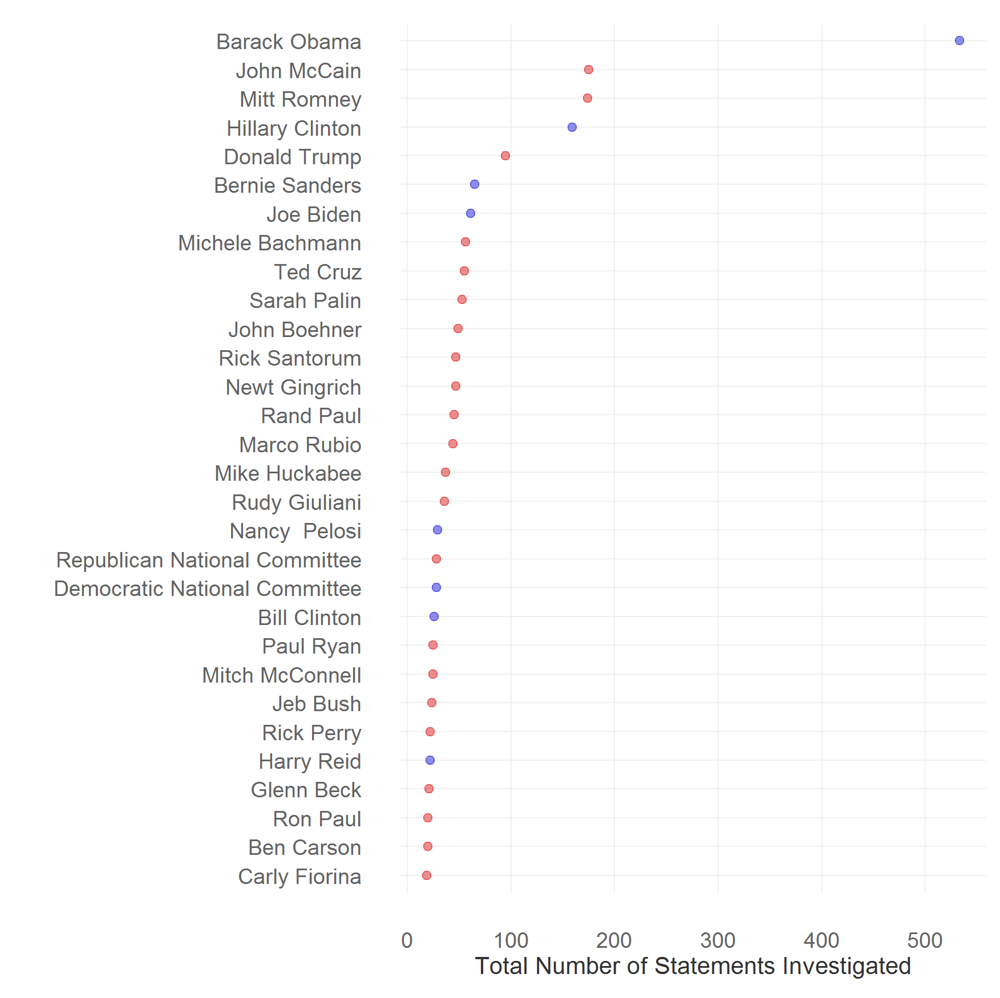
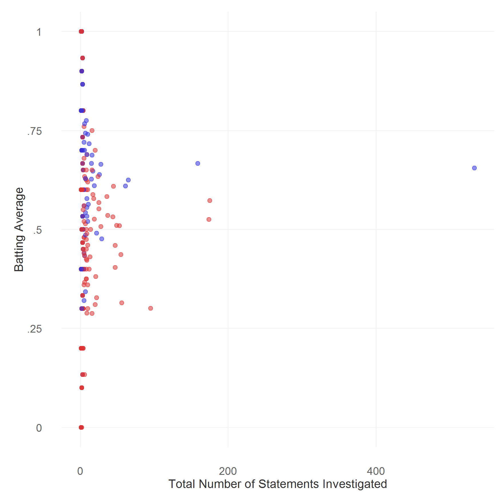

## Some Facts about Politifact

I assessed Politifact on:  

1. **Imbalance in scrutiny**: Do they vet statements by Democrats or Democratic-leaning organizations more than statements Republicans or Republican-leaning organizations?  

2. **Batting average by party**: Roughly n_correct/n_checked, but instantiated here as mean Politifact rating.     		  

To answer the question, I scraped the data from [PolitiFact](http://politifact.com) and independently coded and appended data on party of the person or organization covered. Feel free to download the [script](politifact.R) for scraping and analyzing the data, [scraped data](politifacts.csv) and [data linking people and organizations to party](pol_names.csv).

Until now, Politifact has checked veracity 3,859 statements by 703 politicians and organizations. Of these, I was able to establish the partisanship of 554 people and organizations. I restrict the analysis to 3,396 statements by organizations of people whose partisanship I could establish and whose lean either towards the Republican or Democratic party. I code the Politifact 6-point True to Pants on Fire scale (true, mostly-true, half-true, barely-true, false, pants-fire) linearly so that it lies between 0 (pants-fire) and 1 (true).

Of the 3,396 statements, about 44% (n = 1506) of the statements checked by Politifact are by Democrats or Democratic-leaning organizations. Rest of the roughly 56% (n = 1890) are by Republicans or Republican-leaning organizations. Mean PolitiFact rating of statements by Democrats or Democratic-leaning organizations (batting average) is .63; it is .49 for statements by Republicans or Republican-leaning organizations.

To check whether the results are driven by some people receiving a lot of scrutiny, I tallied the total number of statements investigated for each person. Unsurprisingly, there was a large skew, with few prominent politicians receiving a bulk of the attention. For instance, Politifact investigated more than 500 claims by Barack Obama alone. The figure below plots the total number of statements investigated for thirty politicians receiving the most scrutiny.

When you take out Barack Obama, the percentage of Democrats receiving scrutiny reduces to 33.98%. More generally, if you limit yourself to the bottom 90% of the politicians in terms of scrutiny received, the share of Democrats is still about 42.75%.

To analyze whether there is selection bias in covering politicians who incorrect things more often, I estimated the correlation between batting average and the total number of statements investigated. The correlation --- I adjusted for the skew by trying out rank order correlations and correlation with log of total statements --- are very weak, and do not appear to vary systematically by party. The figure below plots batting average as a function of total statements investigated.

**Caveats About Interpretation**

To interpret the numbers, you need to make two assumptions:      

1. Number of statements made by Republicans and Republican-leaning persons and organizations is the same as that made by people and organizations on the left.   		  

2. Truthiness of statements by Republican and Republican-leaning persons and organizations is the same as that of left leaning people and organizations.  
